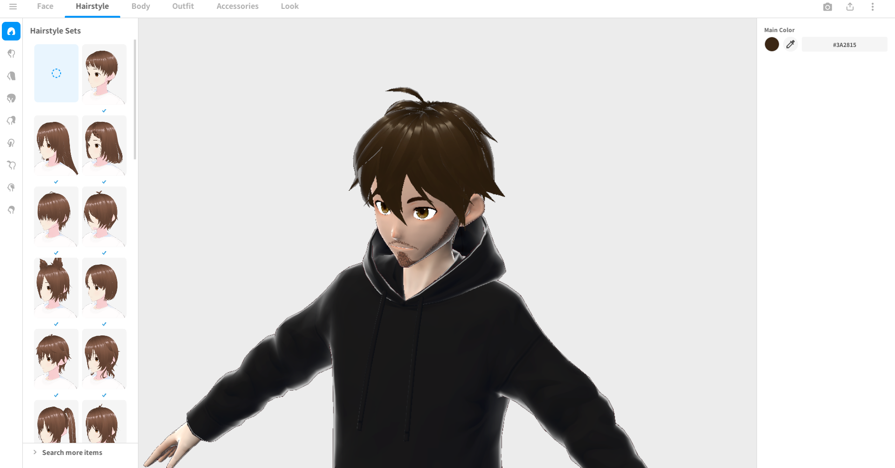
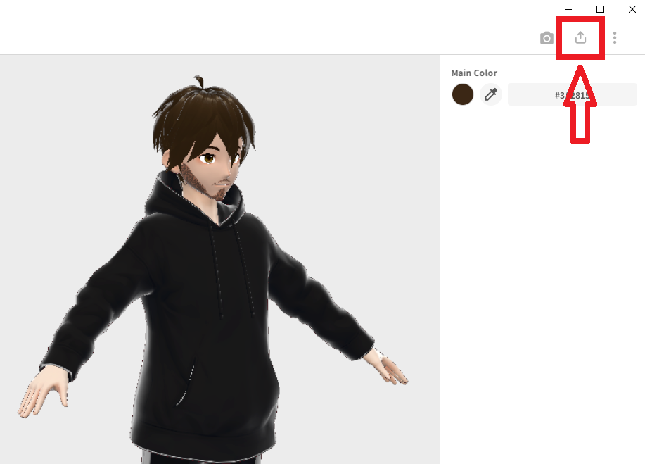

# CustomPlayerModel

This mod allows you to to replace your knight sprite with a 3D model

## How to add your own models
This tutorial will walk you through every step of converting a Vroid model into a usable format for the mod.
If you already have a compatible model, you may be able to skip some steps.

You will need:
- [VRoid Studio](https://store.steampowered.com/app/1486350/VRoid_Studio_v210/)
- [Blender](https://www.blender.org/download/)
- [Unity](https://unity.com/releases/editor/whats-new/2020.2.2) version 2020.2.2
	- Other versions might work, but I can't promise anything
- The [Blender VRM extension](https://extensions.blender.org/add-ons/vrm/)
- The [UniVRM](https://github.com/vrm-c/UniVRM/releases) package

### 1. Design your model in VRoid
I'm not going to explain everything here, just mess around and make what you want.

### 2. Export as VRM from VRoid
In the top corner, select **Export as VRM**. The default settigns should be fine, just click **Export**
