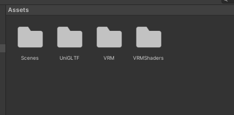
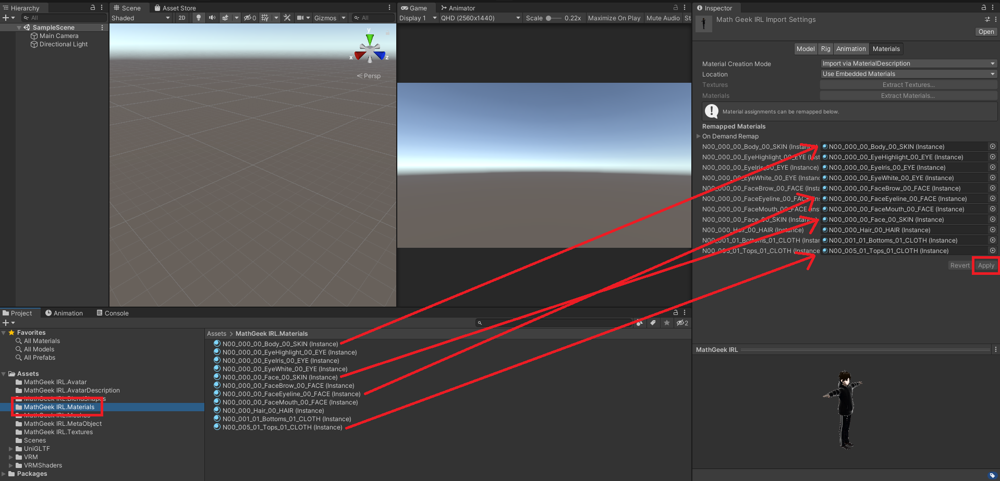

# CustomPlayerModel

This mod allows you to to replace your knight sprite with a 3D model

## How to add your own models
This tutorial will walk you through every step of converting a Vroid model into a usable format for the mod.
If you already have a compatible model, you may be able to skip some steps.
This will take a bit of work, but everything here is free and safe.


You will need:
- [VRoid Studio](https://store.steampowered.com/app/1486350/VRoid_Studio_v210/)
- [Blender](https://www.blender.org/download/)
- [Unity](https://unity.com/releases/editor/whats-new/2020.2.2) version 2020.2.2
	- Other versions might work, but I can't promise anything
- The [Blender VRM](https://extensions.blender.org/add-ons/vrm/) extension
- The [UniVRM](https://github.com/vrm-c/UniVRM/releases) package
	- This mod was built using some older versions of this extension and package, so let me know if anything doesn't work


### 1. Design your model in VRoid
I'm not going to explain everything about VRoid here, just mess around and make what you want.


### 2. Export as VRM from VRoid
In the top corner, select **Export as VRM**. The default settigns should be fine, just click **Export**.


### 3. Import your VRM into Blender and export as an FBX
In Blender, make sure you have the VRM extension installed (Edit > Preferences > Add-ons > Install...).
You can then clear the scene (hotkeys A+X), import your VRM model (File > Import > VRM) and export it as an FBX (File > Export > FBX).

 


### 4. Create a Unity project with UniVRM
Create a new project in version 2020.2.2. This *might* work in other versions, but it has caused me problems, so I can't promise others will work properly.
Drag the UniVRM package into the Assets window, click **Import** on the popup, let it think for a few seconds, and accept any further popups.
You should see this in your Assets window after.




### 5. Drag your FBX model into Unity
Take the FBX you exported from Blender and drag it into Unity's Assets window. It should appear with a collapsible list.
Within this list, make sure the armature/skeleton of your model has the name "Armature" or the mod won't be able to find it (this should be default).
It's fine if all of the materials you see are default gray, we'll fix that in a moment.


### 6. Drag your VRM model into Unity
Take the VRM you exported from VRoid and drag it into Unity's Assets window as well. This should create a bunch of folders with things like textures, meshes, and blendshapes.
At this point I recommend using the slider in the corner to see the filenames better.


### 7. Convert each material's shader to Unlit
When you click on any file in the VRM's materials folder, you will see a **Shader** at the top and a **Rendering Type** just below it.
Because Hollow Knight is a 2D sprite-based game, it doesn't use a full lighting system, so in order for your model's textures to display properly, they will need to use an Unlit shader.
To do this, take note of the Rendering Type (usually either Cutout or Transparent), click the Shader dropdown, select Unlit, and choose the option that matches the rendering type.

  


### 8. Apply the VRM materials to your FBX model
In the Assets window, click on the FBX model. In the project window to the left (assuming that's your layout), select the Materials folder.
Drag each material from the Assets window onto the corresponding field on the right in the Inspector window, then click **Apply**.




### 9. Add this build script
In the Assets window, add a script by right-clicking > Create > C# Script and name it ExportAssetBundle. In a text editor, replace everything in the script with the code below, but replace MODELNAME with whatever you want.
This is the name you will see in Hollow Knight. If you're not on a windows machine, you may also need to edit the BuildTarget to StandaloneLinux or StandaloneOSX.


```
using UnityEngine;
using UnityEditor;

public class ExportAssetBundles {
    [MenuItem("Assets/Build AssetBundle")]
    static void ExportResource() {
        string path = "Assets/MODELNAME.unity3d";
        Object[] selection = Selection.GetFiltered(typeof(Object), SelectionMode.DeepAssets);
        BuildPipeline.BuildAssetBundle(Selection.activeObject, selection, path,
                                       BuildAssetBundleOptions.CollectDependencies
                                     | BuildAssetBundleOptions.CompleteAssets,
                                       BuildTarget.StandaloneWindows);
    }
}
```


### 10. Build the AssetBundle
When you save the script and return to Unity, it will compile the script and grant you access to a new build option.
Select your FBX model in the Assets window, and at the top, click Assets > Build AssetBundle.
This will create a .unity3d file inside your Assets folder (it might not display immediately).


### 11. Move the bundle to your mods folder
If you haven't already, run Hollow Knight once with CustomPlayerModel installed to create the necessary folder.
Then locate your Mods folder and move the unity3d file inside Mods/CustomPlayerModel/Models
